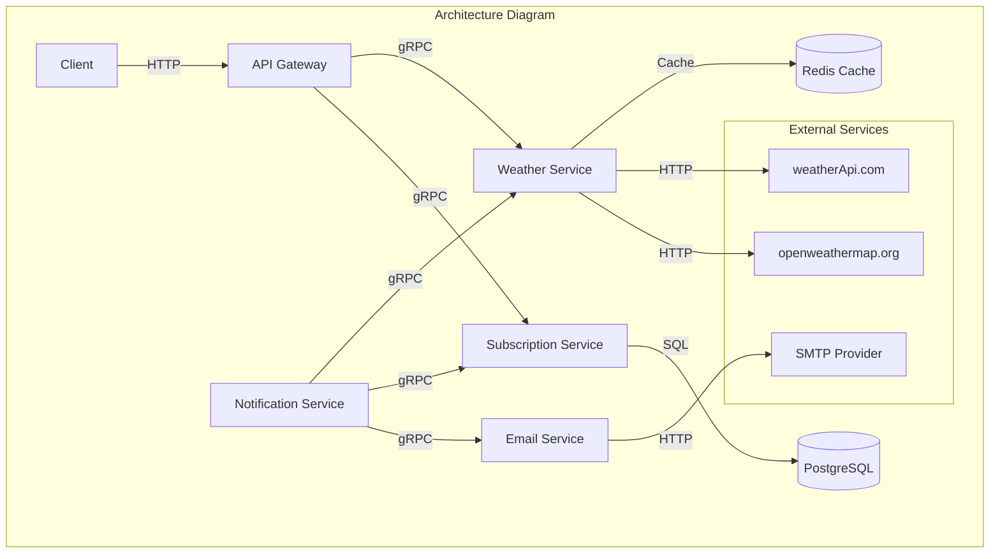

# ADR-006: Transition to Microservice Architecture

Status: Proposed  
Date: 08-07-2025  
Author: Zhukov Vladyslav

## Context

The current Weather API application has a monolithic architecture that combines functionality for
subscriptions, weather data retrieval, messaging, and task scheduling. To adopt new technologies and
enable scalable, resilient, and flexible development, we must migrate from a monolith to
microservices.

## Considered Options

### Architecture Approach:

1.  **Maintain Monolithic Architecture**

    - **Pros:**
      - Simpler development and testing
      - Simplified component interaction
      - Lower DevOps overhead
    - **Cons:**
      - Limited scalability of individual components
      - Low failure isolation
      - Difficulties with implementing changes

2.  **Split into Microservices**

    - **Pros:**
      - Independent component scaling
      - Higher failure isolation
      - Flexibility in technology choices
      - Parallel development by teams
    - **Cons:**
      - More complex infrastructure
      - Requires additional orchestration
      - More challenging integration testing

3.  **Hybrid Architecture (Monolithic Core with Separate Services)**
    - **Pros:**
      - Gradual transition to microservices
      - Preserves advantages of monolithic architecture in key components
    - **Cons:**
      - More complex architecture
      - Less clear boundaries between services

### Communication Protocols:

1.  **REST API**

    - **Pros:**
      - Widely used, easy to implement
      - Simple to understand and debug
      - Doesn't require additional testing tools
    - **Cons:**
      - Less efficient for frequent inter-service communication
      - Higher network overhead

2.  **gRPC**

    - **Pros:**
      - High performance
      - Strong typing through Protocol Buffers
      - Support for bidirectional streaming
      - Efficient use of HTTP/2
    - **Cons:**
      - More complex setup and understanding
      - Requires code generation from .proto files
      - Limited browser support

3.  **GraphQL**
    - **Pros:**
      - Flexible querying of required data
      - Reduction of redundant data
      - Single access point for data
    - **Cons:**
      - Increased complexity for simple interactions
      - Less efficient for internal inter-service communication

## Decision

It was decided to **split the system into microservices** with clear boundaries of responsibility:

1.  **Subscription Service** - managing user subscriptions
2.  **Weather Service** - retrieving and caching weather data
3.  **Notification Service** - formatting and sending messages
4.  **Email Service** - responsible for sending emails

For communication between services, we chose **gRPC** for synchronous inter-service communication,
which provides:

- High performance for frequent communication between services
- Type safety through Protocol Buffers
- Clear contracts between services
- Possibility of bidirectional streaming (e.g., for streaming weather data)

For external communication with clients, we will use **REST API** through an API Gateway.

## Architecture Diagram

## Consequences

**Positive:**

- Each service can be scaled independently
- Failure isolation between services
- Possibility to use different technologies for different services
- Clear boundaries of responsibility between system components
- High performance of inter-service communication thanks to gRPC
- Type safety and API version control through Protocol Buffers
- Reduced network traffic compared to REST API

**Negative:**

- Additional complexity of infrastructure and deployment
- More complex testing
- Possible issues with data consistency between services
- More complex gRPC setup process compared to REST API
- Steeper learning curve for new developers unfamiliar with gRPC
