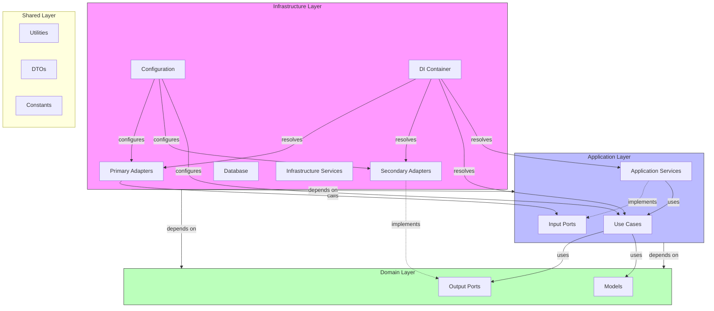

# SAD-001: Ports and Adapters Architecture

**Status:** Accepted  
**Date:** 11-07-2025  
**Author:** Zhukov Vladyslav

## 1. Context

The Weather Forecast API requires a robust, scalable, and maintainable architecture. The system
needs to integrate with various external services (databases, caching systems, external weather
APIs, email services) and expose its functionality through a REST API and background jobs. To keep
the core business logic independent of these external technologies and to facilitate testing, a
clean separation of concerns is crucial.

## 2. Decision

We have chosen the **Ports and Adapters (Hexagonal) Architecture**. This pattern isolates the core
application logic (domain and application layers) from external concerns.

- **Ports** are interfaces that define how the application interacts with the outside world. There
  are two types:
  - **Input Ports (Driving Ports):** Define the API of the application's core logic (use cases).
    They are called by primary adapters.
  - **Output Ports (Driven Ports):** Define the requirements of the application for external
    services (e.g., database access, email sending). They are implemented by secondary adapters.
- **Adapters** are the glue between the ports and the external technologies.
  - **Primary Adapters (Driving Adapters):** Drive the application by calling the input ports (e.g.,
    REST controllers, scheduled jobs).
  - **Secondary Adapters (Driven Adapters):** Implement the output ports and are driven by the
    application (e.g., database repositories, external API clients).

This approach ensures that the core logic is pure and has no dependencies on specific technologies,
making it highly testable and easier to evolve.

## 3. Architecture Diagram

The following diagram illustrates the layers and dependencies in the application. Dependencies flow
from the outer layer (Infrastructure) to the inner layers (Application, Domain). The Domain layer
has no external dependencies.

## 4. Layer Responsibilities

### 4.1. Domain Layer

- **Location:** `src/domain/`
- **Responsibility:** Contains the core business logic, entities, and rules of the application. It
  is completely independent of any external technology.
- **Key Components:**
  - **Models** ([`Weather`](src/domain/models/weather.model.ts)): Business objects with their own
    logic.
  - **Ports** (`src/domain/ports/`): Interfaces defining contracts for data persistence
    ([`ISubscriptionRepository`](src/domain/ports/repositories/subscription-repository.port.ts)),
    caching ([`IWeatherCachePort`](src/domain/ports/cache/weather-cache.port.ts)), external data
    providers ([`IWeatherProviderPort`](src/domain/ports/providers/weather-provider.port.ts)), and
    notifications ([`IEmailPort`](src/domain/ports/notification/email.port.ts)).

### 4.2. Application Layer

- **Location:** `src/application/`
- **Responsibility:** Orchestrates the domain models to perform application-specific tasks (use
  cases). It defines the input ports for the application.
- **Key Components:**
  - **Input Ports** ([`IWeatherInputPort`](src/application/ports/weather.port.ts),
    [`ISubscriptionInputPort`](src/application/ports/subscription.port.ts)): Interfaces that define
    the application's capabilities.
  - **Use Cases** (`src/application/use-cases/`): Implementations of the input ports. They contain
    the logic for specific user stories, like
    [`GetWeatherUseCase`](src/application/use-cases/weather/get-weather.use-case.ts) or
    [`SubscribeUseCase`](src/application/use-cases/subscription/subscribe.use-case.ts). They depend
    on the domain's output ports to interact with external systems.

### 4.3. Infrastructure Layer

- **Location:** `src/infrastructure/`
- **Responsibility:** Contains all the external-facing components and technology-specific
  implementations (adapters). It adapts external requests to the application's input ports and
  implements the domain's output ports.
- **Key Components:**
  - **Primary Adapters:**
    - **API Controllers** (`src/infrastructure/adapters/primary/api/controllers/`): Handle HTTP
      requests, validate input, and call the appropriate use cases (input ports).
    - **Jobs**
      ([`WeatherDigestJob`](src/infrastructure/adapters/primary/jobs/weather-digest.job.ts)):
      Scheduled tasks that trigger use cases.
  - **Secondary Adapters:**
    - **Repositories**
      ([`SubscriptionRepository`](src/infrastructure/adapters/secondary/repositories/subscription.repository.ts)):
      Implements the `ISubscriptionRepository` port using TypeORM and PostgreSQL.
    - **Cache**
      ([`WeatherCacheAdapter`](src/infrastructure/adapters/secondary/cache/weather-cache.adapter.ts)):
      Implements the `IWeatherCachePort` using Redis.
    - **Weather Providers**
      ([`WeatherApiAdapter`](src/infrastructure/adapters/secondary/weather-providers/weather-api.adapter.ts)):
      Implements the `IWeatherProviderPort` by calling external weather APIs.
    - **Email** ([`EmailAdapter`](src/infrastructure/adapters/secondary/email/email.adapter.ts)):
      Implements the `IEmailPort` using Nodemailer.
  - **Configuration:**
    - **DI Container** ([`container.ts`](src/infrastructure/di/container.ts)): Wires all the
      components together using `tsyringe`.
    - **Server Setup** ([`app.ts`](src/app.ts), [`server.ts`](src/server.ts)): Express server
      configuration, middleware, and startup logic.

## 5. Consequences

- **High Testability:** The core logic (Domain and Application) can be tested in isolation using
  mocks for the output ports.
- **Technology Independence:** The core business logic is decoupled from specific technologies,
  making it easier to swap out infrastructure components.
- **Maintainability:** Clear separation of concerns makes the codebase easier to understand and
  maintain.
- **Parallel Development:** Different teams can work on different layers simultaneously.
- **Adaptability:** New features or changes in requirements can be accommodated with minimal impact
  on existing code.
- **Learning Curve:** The architecture introduces additional complexity that new team members need
  to understand.
- **Increased Initial Development Time:** Defining and implementing all the interfaces (ports) takes
  more
