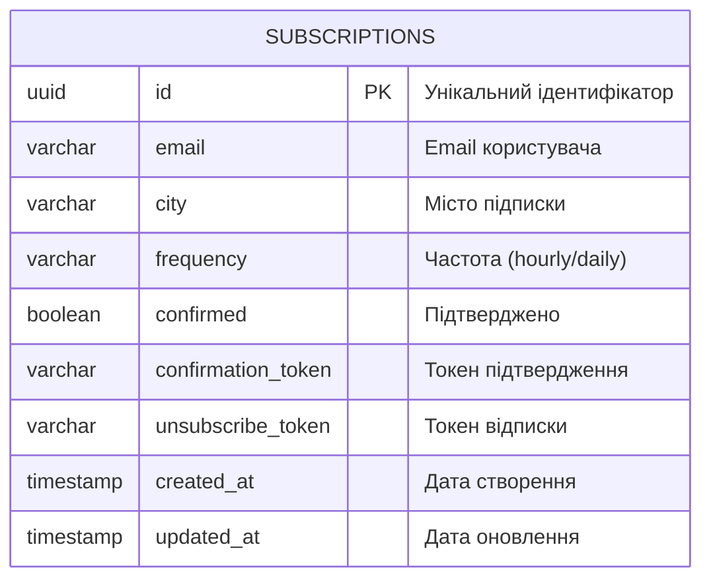
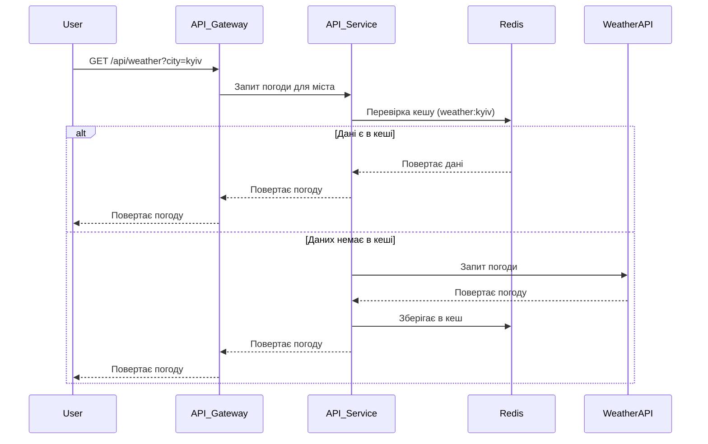
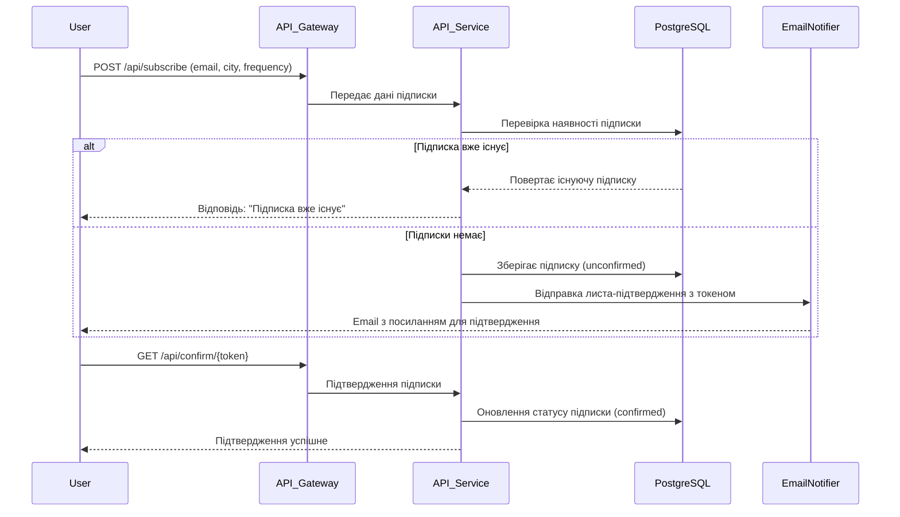
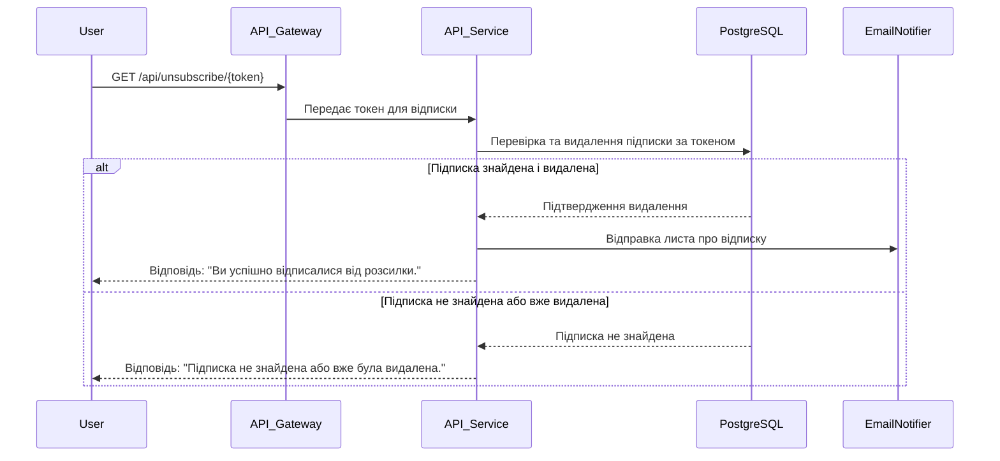

# System Design: Weather Forecast API

## 1. Вимоги системи

**Функціональні вимоги**

- Отримання поточної погоди для заданого міста через API.
- Можливість підписки користувача (email) на оновлення погоди для міста з вибором частоти (щогодини
  або щодня).
- Відправка листа-підтвердження для активації підписки.
- Підтвердження підписки через токен у листі.
- Можливість відписки від розсилки через токен.

**Нефункціональні вимоги**

- **Доступність:** сервіс має бути доступний не менше 99% часу.
- **Масштабованість:** підтримка горизонтального масштабування (декілька інстансів сервісу).
- **Затримка:** середній час відповіді API не більше 500 мс (P95 для запитів, що обслуговуються з
  кешу; для запитів із зовнішнього WeatherAPI допускається більша затримка згідно SLA зовнішнього
  сервісу).
- **Надійність:** автоматичне відновлення після збоїв, збереження підписок.
- **Безпека:** валідація email, захист токенів, захист від несанкціонованого доступу.
- **Модульність та розширюваність:** можливість додавання нових міст, частот, каналів розсилки без
  значних змін у коді.
- **Зручність інтеграції:** REST API, документація Swagger/OpenAPI.
- **Спостережуваність:** логування, моніторинг, аудит подій.
- **Відновлюваність:** швидке відновлення після збоїв або втрати даних.

**Обмеження**

- External API rate limits: 1 000 000 calls per month
- Budget: мінімальна інфраструктура

## 2. Оцінка навантаження

**Користувачі та трафік**

- Активні користувачі: ~20 000
- Середня кількість підписок на користувача: 1–3
- Пікове навантаження: до 1000 API-запитів на секунду
- Відправка повідомлень: до 480 000 на день

**Дані**

- Розмір даних одного користувача: ~200 байт
- Розмір однієї підписки: ~300 байт
- Кеш погоди для одного міста: ~2 КБ
- Орієнтовний загальний обсяг даних: ~100 ГБ на рік

**Пропускна здатність**

- Вхідний трафік: ~1 Мбіт/с
- Вихідний трафік: ~5 Мбіт/с (email)
- Трафік до зовнішнього API: ~50 Мбіт/с

## 3. High-Level архітектура

```mermaid
flowchart LR
    subgraph Інфраструктура
        A[API Gateway]
        B[API Service]
        C[PostgreSQL]
        D[Redis]
        E[Scheduler]
        F[Email Notifier]
    end
    G[Weather API (External)]
    A --> B
    B --> C
    B --> D
    B --> F
    B --> E
    E --> B
    E --> F
    B --> G
```

## 4. Детальний дизайн компонентів

### 4.1 API Service (Node.js/Express)

**Відповідальність:**

- Обробка REST API запитів від користувачів через API Gateway
- Валідація вхідних даних (місто, email, частота)
- Автентифікація користувачів
- CRUD операції з підписками
- Взаємодія з Redis для кешування погодних даних
- Взаємодія з PostgreSQL для зберігання користувачів та підписок
- Взаємодія з Email Notifier для відправки листів
- Взаємодія з Scheduler для планування розсилок
- Отримання актуальної погоди з зовнішнього Weather API
- Обробка помилок та логування подій

**Endpoints:**

- `GET /api/weather?city={city}` — отримати поточну погоду для міста
- `POST /api/subscribe` — оформити підписку на оновлення погоди (email, місто, частота)
- `GET /api/confirm/{token}` — підтвердити підписку через токен з email
- `GET /api/unsubscribe/{token}` — відписатися від розсилки через токен

**Технологічний стек:**

- **Node.js / Express** — серверна частина, реалізація REST API
- **PostgreSQL** — основна база даних для зберігання користувачів та підписок
- **Redis** — кешування погодних даних
- **Nodemailer** або аналог — відправка email-повідомлень
- **node-cron** — планування та виконання періодичних задач (Scheduler)
- **Swagger (OpenAPI)** — документація API
- **Docker** — контейнеризація сервісів
- **WeatherAPI.com** — зовнішній сервіс для отримання погодних даних

**Моделі даних:**

1. **Weather**

   - `temperature` — температура повітря (число)
   - `humidity` — вологість (%)
   - `description` — короткий опис погоди (рядок)

2. **Subscription**

   - `email` (обовʼязково) — email користувача
   - `city` (обовʼязково) — місто підписки
   - `frequency` (обовʼязково) — частота оновлень (наприклад, hourly, daily)
   - `confirmed` — статус підтвердження підписки (true/false)

### 4.2 Weather API Integration

**Caching Strategy:**

- L1 Cach (redis): 5-хвилинний TTL для прогнозу погоди
- Fallback: останні кешовані дані при API недоступні

**Використовуваний зовнішній сервіс:**

- [WeatherAPI.com](https://www.weatherapi.com/) — REST API для отримання актуальної погоди за
  містом.

### 4.3 PostgreSQL

**Відповідальність:**

- Зберігання інформації про підписки користувачів, статус підтвердження, токени для підтвердження та
  відписки, а також часові мітки створення та оновлення.
- Забезпечення унікальності підписки для комбінації email + місто + частота.

**Структура таблиці `subscriptions`:**

| Поле               | Тип          | Опис                                   |
| ------------------ | ------------ | -------------------------------------- |
| id                 | uuid         | Унікальний ідентифікатор підписки (PK) |
| email              | varchar(255) | Email користувача                      |
| city               | varchar(100) | Місто підписки                         |
| frequency          | varchar(6)   | Частота оновлень (hourly/daily)        |
| confirmed          | boolean      | Статус підтвердження підписки          |
| confirmation_token | varchar(64)  | Токен для підтвердження підписки       |
| unsubscribe_token  | varchar(64)  | Токен для відписки                     |
| created_at         | TIMESTAMP    | Дата створення підписки                |
| updated_at         | TIMESTAMP    | Дата останнього оновлення              |

- **Унікальний індекс:** комбінація `email`, `city`, `frequency` (неможливо створити дубль підписки
  для одного користувача на одне місто з однаковою частотою).

**Діаграма таблиці:**



## 5. Діаграми послідовностей

### 5.1 Отримання погоди для міста



### 5.2 Підписка на розсилку погоди



### 5.3 Видалення підписки



## 6. Опис безпеки

- Валідація email та параметрів запитів на бекенді.
- Токени підтвердження та відписки — одноразові, з обмеженим терміном дії, зберігаються у базі.
- Захист від спаму: rate limiting для endpoint-ів підписки та підтвердження.
- Всі критичні дії логуються.
- Захист від XSS/CSRF (CORS, helmet, sanitization).
- Доступ до Redis та PostgreSQL — лише з внутрішньої мережі.
- Відправка email через захищені SMTP-з'єднання.
- Зберігання паролів (якщо є) — тільки у хешованому вигляді (bcrypt).

## 7. Опис тестування

- **Unit-тести:** для основної бізнес-логіки (обробка підписок, кешування, робота з API).
- **Integration-тести:** для перевірки взаємодії між компонентами (API, база, кеш, email).
- **E2E-тести:** сценарії користувача (отримання погоди, підписка, підтвердження, відписка).
- **Тестування помилок:** імітація недоступності зовнішніх сервісів (Weather API, email).
- **Тестування навантаження:** перевірка роботи під піковим навантаженням (1000 RPS).

## 8. Опис розгортання (Deployment)

- Всі сервіси контейнеризовані через Docker.
- Використовується docker-compose для локального розгортання.
- Для продакшн — деплой у хмару (наприклад, AWS, GCP, Azure) або на власний сервер.
- CI/CD: автоматичне тестування та деплой через GitHub Actions/GitLab CI.
- Використання .env для конфігурації (ключі, паролі, URL).

## 9. Приклади запитів і відповідей (API examples)

### 9.1 Отримати погоду

**Запит:**

```bash
GET /api/weather?city=kyiv
```

**Відповідь:**

```json
{
  "temperature": 21,
  "humidity": 60,
  "description": "clear sky"
}
```

### 9.2 Оформити підписку

**Запит:**

```bash
POST /api/subscribe
```

```json
{
  "email": "user@email.com",
  "city": "kyiv",
  "frequency": "hourly"
}
```

**Відповідь:**

```json
{
  "message": "Підписка створена. Перевірте email для підтвердження."
}
```

### 9.3 Підтвердити підписку

**Запит:**

```bash
GET /api/confirm/eyJhbGciOiJIUzI1NiIsInR5cCI6IkpXVCJ9...
```

**Відповідь:**

```json
{
  "message": "Підписка підтверджена."
}
```

### 9.4 Відписатися

**Запит:**

```bash
GET /api/unsubscribe/eyJhbGciOiJIUzI1NiIsInR5cCI6IkpXVCJ9...
```

**Відповідь:**

```json
{
  "message": "Ви успішно відписалися від розсилки."
}
```
